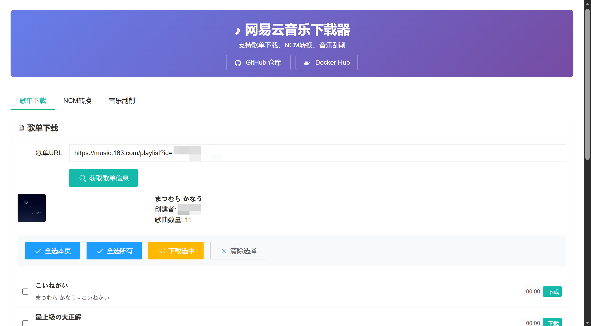
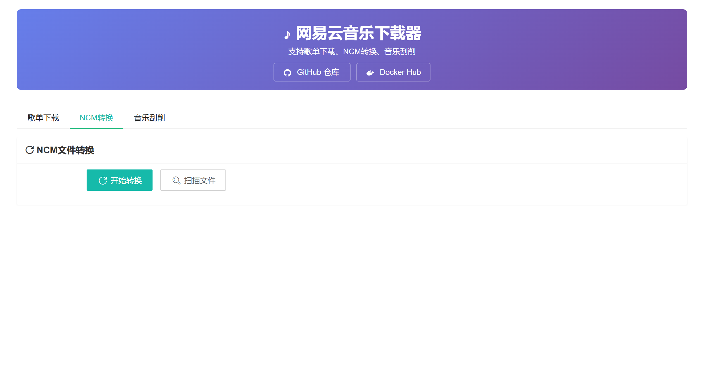

<div align="center">


<h3>ncm-dl</h3>

Docker version of NCM-Downloader
</div>

## Screenshots






## Deployment
In `docker-compose.yml`:
```yaml
volumes:
      - "/path/to/your/playlist/dir:/app/playlist"
      - "/path/to/your/ncm_file/dir:/app/ncm"
      - "/path/to/your/to_scrape_music/dir:/app/scrape"
```

Change these paths to where you store your music files.

```shell
docker-compose up -d
```